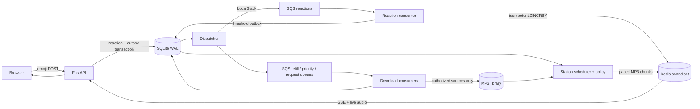

# RadioWorkx

A shared live radio website with a **FastAPI backend**, Bandcamp catalog, emoji reactions over **SSE**, **SQS on the [lotusbaba/localstack fork](https://github.com/lotusbaba/localstack)**, and genre rankings in a **Redis sorted set**.

The responsive website includes live playback, six reaction buttons, community activity, genre rankings, recently played tracks, and Bandcamp artist links. The station chooses the music. Listeners see a live preview of up to ten upcoming plays, the next eligible song, and a separate download queue; they can request recordings through the catalog chat but cannot seek.


**The local station now plays real music.** It uses a 30-track catalog from ten Bandcamp artists with explicit CC BY 4.0 / CC BY-SA 4.0 licenses. A random ten-genre, ten-artist batch is downloaded through SQS; the remaining catalog provides refill/follow-up candidates. See `catalog/open-license.json`. The player displays the artist, source link, license link, and format-conversion notice.

The active local configuration uses `DEMO_MODE=0`, `RADIO_DATA_DIR=/data/live`, `REDIS_DB=1`, and `QUEUE_PREFIX=radio-live`. This preserves the earlier demo’s audio/history/votes separately.

## Run locally

Requires Docker Desktop / Docker Engine with Compose v2. The first build downloads Python dependencies, FFmpeg, Redis, and the requested LocalStack source.

```sh
cp .env.example .env
# Set SESSION_SECRET in .env to a long random value.
docker compose up -d --build
```

Open **http://localhost:8000**. FastAPI API documentation is at **http://localhost:8000/docs**. Choose another `RADIO_PORT` in `.env` if 8000 is occupied.

**For a fresh installation**, import `catalog/open-license.json` as described below to enable the provided real-music catalog. The original `catalog/bandcamp.json` is an additional metadata-only example. No purchase or Bandcamp account access is automated.

For a working audio demo, set `DEMO_MODE=1` in `.env` and run `docker compose up -d`. This creates a separate set of fictional artists and locally generated 45-second tones, exercises the same queues and scheduler, and prominently labels the page as a demo. These tones are **not** the listed artists’ music and are not advertised as Bandcamp tracks. Use a fresh Compose project/volume when switching from demo to real broadcasting; demo history and rankings are otherwise retained.

```sh
docker compose ps
docker compose logs -f station reactions downloads dispatcher
docker compose down    # stops services; retains the library, votes, and history
```

The LocalStack image is built directly from fork revision `8b9a79f05846835cf4dff63ab7eefdde9df83783`, with that revision’s checked-in runtime dependency pins. It does not silently substitute the upstream Docker image. Only SQS is enabled; no Docker socket mount or cloud credentials are needed. Redis runs separately, as requested, rather than emulating ElastiCache.

## Requirements and implemented behavior

| Requirement | Behavior |
| --- | --- |
| Fast API backend | FastAPI serves the site, JSON APIs, the shared live MP3 stream, and SSE. |
| Random initial playlist of 10 Bandcamp tracks, each a different genre and artist | A shuffled, backtracking sampler selects exactly 10 distinct genres with disjoint featured artists from the operator catalog. It waits if no valid set of 10 exists. `catalog/initial-selection.json` records the first real ten-track batch selected from the licensed source pool; later batches are selected at runtime from usable sources. |
| Different artists | All `artists` entries are considered, including featured collaborators. Stable, canonical names/IDs must be used across the catalog. |
| Emoji reactions | ❤️ 🔥 🙌 😍 💃 🤯. The same listener session can react repeatedly, including the same emoji on the same track, after a one-second cooldown between accepted reactions. The page displays a countdown. SQLite atomically enforces the cooldown across tabs and restarts. Each emoji counts as one positive reaction. |
| Broadcast reactions with SSE | `/api/events` sends reaction events, track transitions, ranking/state snapshots, IDs, and periodic heartbeat snapshots. Reconnection uses `Last-Event-ID`. |
| Capture reactions on SQS, including artist and genre | Accepted events are first committed with a SQLite outbox, then dispatched to `radio-reactions`. Message bodies carry track, play, all featured artists, album, genre, emoji, accepted timestamp, and listener ID. Artist and genre are also SQS message attributes. |
| Consumer ranks genres in Redis | The reaction worker performs an idempotent Redis Lua transaction using `ZINCRBY` on `radio:genres` and appends an SSE event to `radio:events`. Rankings show outstanding reaction demand, highest first; a successful listener-request or reaction-triggered acquisition removes the fulfilled genre. |
| More than 20 artist or genre reactions before the track ends | Default `REACTION_THRESHOLD=20`: the 21st processed reaction during the current play creates one priority download job. All reactions on that play share its artist(s)/genre, so the two simultaneous crossings are coalesced. Counts reset with each play; the genre score clears when its requested acquisition succeeds. |
| Grab another song from that artist or album | A priority job randomly selects a different authorized track sharing an artist or album, falling back to the current genre if neither is available. If no suitable source exists, it records that fact and keeps the current program. |
| Immediately download at threshold | `radio-priority-downloads` has its own consumer thread, separate from normal refill downloads. The priority job starts as soon as dispatched/received, even while a refill runs. Downloads are asynchronous and subject to source/network availability. |
| Fetch only when needed | At startup, or when **current track + queued tracks ≤ 3**, the station enqueues a refill of 10. Only one refill is outstanding at a time; waiting/empty catalogs retry at most once every five minutes. |
| Download 10 more tracks | Refill selection prefers 10 previously undownloaded tracks across 10 genres. If the available source catalog cannot supply that set, it supplements with cached tracks. It never manufactures sources. Within the last slots before the cap, it downloads only the remaining capacity. |
| SQS downloader jobs and consumers | Durable job plans, per-track completion, SQS retries, capacity reservations, bounded downloads, MP3 normalization, and atomic file replacement. A partial batch retry does not requeue tracks already handled or transmitted. |
| Stop at 10,000 downloaded tracks | SQLite serializes slot reservations across all three download consumers. Completed downloads plus active reservations cannot exceed **10,000**. At 10,000 successful unique catalog track downloads, a durable latch permanently disables new acquisition, including reaction-triggered downloads. |
| Reuse the library after the cap | All later refills and reaction follow-ups use only existing downloaded tracks. Artist, album, compilation, and consecutive limits still apply. The cap is station-wide, not per playlist; there is no automatic eviction/reset. |

The threshold is configurable, but the 10,000-track maximum is deliberately a code-level ceiling. A “track” for capacity accounting means a unique canonical catalog ID. Do not import the same recording under multiple IDs.

## SoundExchange scheduling constraints

The scheduler checks these **immediately before transmitting**, including priority tracks:

| Identity | Maximum transmissions in rolling 3 hours | Maximum consecutive transmissions |
| --- | ---: | ---: |
| Each featured artist | 4 | 3 |
| Compilation album | 4 | 3 |
| Album | 3 | 2 |

These are the requested [SoundExchange performance-complement limits](https://www.soundexchange.com/service-provider/licensing-101/). Every play is recorded durably before its first audio bytes. A performance that overlaps the start of the rolling window still counts. Repeated recordings count as further transmissions. All featured artists are checked. Compilation identity has its own limit, and the album limit also applies conservatively when both identities are supplied. Silence does not reset consecutive history.

There is one common station feed. Applying the rules to the entire station’s transmission history is **more restrictive than a per-listener ledger**, and protects every listener regardless of reconnects or new cookies. If every queued track would violate a limit, the station waits. Reactions never bypass the check or guarantee which track plays next. A restart ends an interrupted performance and chooses a new eligible track rather than restarting the recording.

These scheduling rules alone do **not** establish eligibility for a statutory license. SoundExchange also describes noninteractive operation, restrictions on advance playlists and short continuous programs, recording/composition rights, payments, and reporting. At the user’s request, the app now publishes upcoming track identities and download progress. The playlist display and listener requests are intended for the directly licensed Creative Commons catalog and is not a claim of eligibility for the statutory noninteractive license. There is still no on-demand audio endpoint. Reaction-driven programming and your proposed service still need the applicable rights and eligibility review; this project does not certify compliance or produce royalty reports. See [SoundExchange licensing guidance](https://www.soundexchange.com/service-provider/licensing-101/) and [reporting requirements](https://www.soundexchange.com/service-provider/reporting-requirements/).

## Bandcamp catalog and audio sources

`catalog/bandcamp.json` contains 13 discovered candidates in ten station-assigned primary genres. Artist pages were checked on September 6, 2026. Genre categories are programming metadata, not a claim that each recording has only one genre. The separate `catalog/initial-selection.json` now records the first real-music selection from `catalog/open-license.json`; the current ten-track batch is now displayed on the website.


| Genre | Artist | Selected Bandcamp track |
| --- | --- | --- |
| electronica | Bonobo | [Kerala](https://bonobomusic.bandcamp.com/track/kerala) |
| folk | INK. | [Folk Song](https://ink-official.bandcamp.com/track/folk-song) |
| soul | James Alexander Bright | [Soul](https://jamesalexanderbright.bandcamp.com/track/soul) |
| hip-hop | The X & Tricks | [Enigma - Hip Hop Instrumental](https://thexandtricks.bandcamp.com/track/enigma-hip-hop-instrumental) |
| punk | Other Galaxies | [Punk is Dead](https://othergalaxies.bandcamp.com/track/punk-is-dead-2) |
| doom metal | SUMMA | [Tides of Doom](https://summadoom.bandcamp.com/track/tides-of-doom) |
| afrobeat | Kokoroko | [Adwa](https://kokoroko.bandcamp.com/album/kokoroko) |
| ambient | Nate Tatem | [Ambient Loop 2](https://n8t8m.bandcamp.com/track/ambient-loop-2) |
| jazz | Nubya Garcia | [Pace](https://nubyagarcia.bandcamp.com/album/source) |
| techno | Wreckless | [Estimate (Techno)](https://wrecklessdnb.bandcamp.com/track/estimate-techno) |

To generate a separate metadata-only example from the original candidate pool:

```sh
python3 -m venv .venv
. .venv/bin/activate
pip install -c requirements.lock -e '.[test]'
python scripts/select_playlist.py > /tmp/radio-metadata-example.json
pytest -q
```

To enable real audio, prepare a JSON catalog using the same metadata fields and add **authorized final HTTPS audio URLs** and a `rights` reference. A Bandcamp purchase/download receipt is not by itself a grant of rebroadcast rights. Bandcamp’s [Terms of Use](https://bandcamp.com/terms_of_use) and [streaming/download help](https://get.bandcamp.help/en/articles/15263360-what-are-streaming-limits-on-bandcamp) distinguish previews and fan purchases from third-party reuse. The ordinary URL adapter does not scrape preview media or bypass payment. The `bandcamp_cc` adapter is narrowly limited to publicly released recordings with an explicit, verified CC BY or CC BY-SA license; it resolves their public MP3 rendition and rechecks the track identity and license at acquisition time. It never accesses private streams or all-rights-reserved recordings, and does not automate purchases. You supply permitted source URLs or host authorized copies at an allowlisted HTTPS origin.

```json
[
  {
    "id": "your-canonical-track-id",
    "title": "Track title",
    "artists": ["Canonical featured artist", "Any featured collaborator"],
    "album": "Album title",
    "album_id": "canonical-album-id",
    "compilation_id": null,
    "genre": "jazz",
    "bandcamp_url": "https://artist.bandcamp.com/track/title",
    "source_url": "https://your-authorized-audio.example/title.flac",
    "rights": "Permission agreement or applicable licensing record reference"
  }
]
```

Include at least ten different genres and artists, and more tracks by those artists/albums to enable discovery follow-ups. Album IDs must identify the actual release, not just an album title shared by unrelated artists. The downloader probes actual duration; guessed metadata durations are not used for scheduling.

1. Set `DOWNLOAD_HOSTS=your-authorized-audio.example` and `DEMO_MODE=0` in `.env`. Multiple **exact hostnames** can be comma-separated. Only allow trusted origins; the allowlist is an operator security boundary.
2. Copy/import the catalog (not audio) and recreate services to apply configuration:

   ```sh
   docker compose cp catalog/authorized.json api:/tmp/authorized.json
   docker compose exec api python scripts/import_catalog.py /tmp/authorized.json
   docker compose up -d
   ```

3. The station’s next refill acquires approved audio as needed. Add more source entries using the same command later. Source URLs remain internal and are not sent to the browser or included in logs.

Downloads reject redirects, non-HTTPS/non-allowlisted origins, files larger than 200 MiB, transfers longer than 300 seconds, and audio outside 1–1,800 seconds. FFmpeg accepts only local file/pipe protocols for decoding and normalizes audio to stereo 44.1 kHz, 128 kbps MP3. Downloaded identity metadata is immutable so edits cannot evade historical scheduling limits.

## Architecture



**Durable state:** one SQLite database on the shared `radio-data` Docker volume stores catalogs, playlist, plays, reactions, outbox, job progress, and the permanent cap latch. `audio/` on the same volume holds normalized recordings. Redis uses AOF with `appendfsync always` on a separate volume. Back up both volumes together before changing deployments.

**Queue processing:** standard SQS queues with at-least-once delivery; each has a `-dead` dead-letter queue after five unsuccessful receives. Reactions have 60-second visibility; downloads have 900 seconds. Visibility is renewed while a message is being processed. Outbox records are marked complete only after durable job processing and Redis projection. Unacknowledged outbox records are resent after 20 minutes to recover from loss of LocalStack’s in-memory queue state. Exhausted jobs stop automatic outbox resends and retain their failure type for operator review. Queue initialization is automatic and idempotent.

**Idempotence:** A stable event ID deduplicates retries of one submission, while new submissions are allowed after a one-second session cooldown; Redis atomically remembers projected event IDs and writes the ranking and reaction event together. Job plans and each successful enqueue are persisted. SSE retains approximately 2,000 events and sends fresh state snapshots, so reconnecting listeners converge even if their old cursor falls outside retained history. Event IDs are retained for projection deduplication; plan archival/compaction for long-running deployments.

**Audio:** the station runs one paced FFmpeg process at a time. It publishes bounded MP3 chunks through a separate Redis stream; `/api/live` starts each connection at the live edge. Slow connections shed backlog rather than becoming an archive. Browser buffering means listeners can differ by a few seconds; reaction acceptance uses the server’s current play and server timestamps. Tune out disconnects; tuning back in rejoins live. Browser autoplay requires a user click.

**Timing:** both acceptance and threshold processing must occur before the play ends. A delayed reaction still contributes to the genre demand ranking, but it cannot trigger a follow-up after the current track ends. No forced skipping or interruption occurs on a threshold crossing.

## API

| Endpoint | Purpose |
| --- | --- |
| `GET /` | Website; creates a signed HttpOnly, SameSite listener cookie. |
| `GET /health` | API/storage liveness. Compose independently checks LocalStack and Redis. |
| `GET /api/status` | Current track, live preview of up to ten upcoming plays, next eligible track, pending/active download queue, genre ranking, emoji counts, recent plays, library counts, and server clock. |
| `GET /api/session` | Current session’s next allowed reaction time; used to restore the cooldown after refresh. |
| `GET /api/events` | SSE: `snapshot`, `reaction`, `track`, `track_end`; supports `Last-Event-ID`. |
| `GET /api/live` | Live MP3 feed for a valid listener session; no track or time parameters. |
| `POST /api/reactions` | `{ "play_id": "UUID", "emoji": "🔥" }` → HTTP 202 and durable event ID. |

Reaction responses: `401` missing/invalid session, `409` expired or stale play, `422` unsupported emoji/invalid ID, `429` one-second session cooldown, with a `Retry-After` header. A 202 means durably queued, not already processed.

## Verification and operating limits

Automated tests cover random genre/artist diversity, backtracking, artist/album/compilation boundaries, overlapping rolling windows, featured artists, history across silence, priority scheduling, stalled schedules, 20 versus 21 votes, duplicate delivery, late reactions, trusted metadata, session validation, low-water refill accounting, partial download recovery, cached content selection, concurrent slot reservations, and the permanent cap latch.

The checked-in dependency constraints reproduce the tested application environment. FFmpeg is included in Docker; native worker execution additionally requires FFmpeg/ffprobe and Redis. The application has one station and one host with shared local storage. Per-role filesystem locks prevent duplicate station/dispatcher processes; the downloader has one normal, one reaction-priority, and one listener-request consumer. Scaling across hosts would require a distributed store and leader fencing, not just extra replicas.

This is a local development implementation. Before public operation, add authenticated listener identities/abuse controls (cookies can be cleared), TLS and proxy settings that disable SSE/audio buffering, backup/retention operations, monitoring/alerts for queue failures, and the licensing/reporting workflow applicable to your service. There is no administrative endpoint accepting arbitrary download URLs. Do not expose LocalStack publicly; Compose binds it and the website to loopback.

## Verified in this workspace

- **30 automated tests passed**, including a real 9,999 → 10,000 metadata reservation boundary test (no mass audio download).
- The pinned LocalStack fork and all seven Compose services started successfully.
- The demo selected ten genres and ten different artists; 21 simulated listener reactions passed through SQS, incremented the Redis genre score, and completed one same-artist priority acquisition.
- Headless Chrome verified live audio advancing, reaction submission and SSE activity, desktop/mobile layout without horizontal overflow, and no JavaScript errors.
- The original browser smoke test used clearly labeled generated demo tones. The current `.env` selects the separate real-music station. This was the initial demo verification; the real-music catalog was enabled afterward.

Repeat the live integration check in **demo mode only** (it intentionally creates 21 test reactions):

```sh
docker compose exec -T api python scripts/integration_smoke.py
```

For the optional UI check, install `playwright` in the virtual environment and install Google Chrome, then run `python scripts/browser_smoke.py`. It writes desktop/mobile screenshots to `/tmp/radioworkx-browser` and sends the same emoji twice, one second apart, when a track is live; it also checks that the live playlist rows and the download section are visible.

### Checking silent or quiet playback

The generated demo sources are intentionally low-level. The station applies a 32× (+30 dB) gain only to demo playback, including previously cached tones. Real recordings keep their original playback level. This produces an audible demo without clipping. Click **Tune in** to start sound; an advancing track timeline alone only indicates the station clock.

Measure the actual decoded HTTP stream, including its signal level:

```sh
docker compose cp scripts/check_audio_level.py api:/tmp/check_audio_level.py
docker compose exec -T api python /tmp/check_audio_level.py
```

This captures about eight seconds from `/api/live`, decodes the MP3, and checks that demo audio averages between −30 and −10 dBFS with at least 1 dB of peak headroom.

## The real-music catalog

The source pool has ten station-assigned genre categories. It is a candidate catalog, **not an advance broadcast order**. `catalog/open-license.json` includes source and license evidence for each track.

| Genre | Artist | Release |
| --- | --- | --- |
| Chiptune | HeXXeL | [Chromium](https://hexxel.bandcamp.com/album/chromium) |
| Vaporwave | Stevia Sphere | [Collection](https://steviasphere.bandcamp.com/album/collection) |
| Jazz | Justin Allan Arnold / IFNESS | [Jazz — Royalty Free — Compilation](https://justinallanarnold.bandcamp.com/album/jazz-royalty-free-compilation) |
| Metal | Alexander Nakarada | [Construction](https://alexandernakarada.bandcamp.com/track/construction-3) |
| Ambient | Chris Zabriskie | [Cylinder One](https://chriszabriskie.bandcamp.com/track/cylinder-one) |
| Orchestral | Leonard Richter | [The Hunt Begins](https://leonardrichter.bandcamp.com/track/the-hunt-begins) |
| EDM | Storm Maverick | [Your Majesty](https://thelionrecords.bandcamp.com/album/your-majesty-creative-commons-free-ep) |
| Folk | Dan Whalen | [One Man Band](https://danwhalen.bandcamp.com/album/one-man-band) |
| Funk | Broke For Free | [Slam Funk](https://brokeforfree.bandcamp.com/album/slam-funk) |
| Trip-hop | Tryad | [Listen](https://tryad.bandcamp.com/album/listen) |

Their Bandcamp license sections were checked for this setup; the downloader verifies the selected **track page** again immediately before acquiring audio. Tryad uses [CC BY-SA 4.0](https://creativecommons.org/licenses/by-sa/4.0/); the other selected sources use [CC BY 4.0](https://creativecommons.org/licenses/by/4.0/). The recordings retain their original licenses. Only MP3 format conversion is applied. Attribution, source and license links accompany the current track. The compilation identity for Justin Allan Arnold’s release is recorded separately for scheduling limits.

To enable this catalog in a fresh setup:

1. Set `DEMO_MODE=0`. Add the ten artist hostnames in `catalog/open-license.json` and `t4.bcbits.com` to `DOWNLOAD_HOSTS`. For separate state after a demo, set `RADIO_DATA_DIR=/data/live`, `REDIS_DB=1`, and `QUEUE_PREFIX=radio-live`.
2. Start the containers, then run `docker compose exec api python scripts/import_catalog.py catalog/open-license.json`. The next scheduled refill will choose and download ten tracks.
3. Listen at `http://localhost:8000`. A new source or changed license fails closed for review; it does not silently fall back to unlicensed media.

Media delivery URLs expire, so the catalog stores the stable Bandcamp track URL, not a signed CDN URL. `source_kind: bandcamp_cc` selects this restricted resolver. Only explicitly allowlisted page and media hostnames are permitted. The catalog builder can refresh the reviewed release metadata with `PYTHONPATH=. python scripts/build_open_catalog.py --refresh`; this fetches metadata only, not the whole audio pool. Individual audio acquisition still occurs only in the SQS consumers.

The 30-source pool is finite. If a genre has no additional available recording while its sole track is already queued, a complete ten-genre refill can wait until that recording leaves the queue. At small library sizes the performance complement can also temporarily leave no eligible track. Expand the authorized catalog to support sustained variety; the scheduler never relaxes its limits to fill silence.

Real-music verification: the first batch completed with **10 downloaded recordings, 10 genres, and 10 different artists**, with no download failures. The live MP3 capture measured −24.0 dBFS average and −6.4 dBFS peak; Chrome verified playback, SSE reactions, and the artist/license credits on desktop and mobile without JavaScript errors.

Playlist and download progress refresh through SSE snapshots approximately every two seconds. The playlist simulates up to ten upcoming plays using the same candidate-selection function as transmission, with Up next / Coming up labels. It includes eligible requests, priority selections, and cached fallback. Projected history enforces limits across future selections. Unknown download completion times are not predicted: unfinished audio stays in the download/request queues until ready. Fewer than ten entries appear when the known ready library cannot fill the preview. Completed performances appear in Recently played; a recording may reappear only as a newly scheduled eligible replay. The next eligible track is calculated from actual queue priority and scheduling constraints and rechecked when transmitted. Download rows show each known song as Queued, Downloading, or Retry pending; an unplanned job says Selecting tracks until its titles are known. An empty download queue is shown explicitly rather than inventing a future download.

Existing reaction records are migrated without losing event IDs, counts, processing state, or timestamps. Replaying a submitted `event_id` returns the original event; a fresh event with the same session and emoji after one second produces another counted reaction.


### Track-request chat and FIFO scheduling

The chat accepts song titles, artist names, and album names, with Everything / Track / Artist / Album selectors. Phrases such as `play <title>` and `something by <artist>` are supported. Matching ignores case, accents, and punctuation, prefers exact matches, and otherwise uses substring matches. An artist or album request selects one matching song; an ambiguous search explains that one match was selected. Replies are generated locally, without an external AI service. Searches cover the imported, authorized station catalog, not all of Bandcamp. Missing or unavailable matches produce a clear reply and no queue entry.

Each accepted request gets a durable increasing sequence number. Ready, eligible requests play in arrival order ahead of automatic and reaction-priority tracks, after the current song finishes. Blocked or unfinished requests move to the bottom of the displayed queue and never prevent eligible music from playing. They retain their arrival sequence and rejoin the eligible group when ready. Duplicate submissions with the same request UUID are idempotent; distinct requests for the same recording remain separate. A requested track is removed from the automatic queue to avoid an accidental duplicate. The public listener queue updates through SSE, while chat history is private to the signed listener session and persists across refreshes.

Uncached requests immediately create durable outbox work for the `request-downloads` SQS queue (with the configured queue prefix). Its dedicated consumer can download alongside automatic batches. Download completion and SQS delivery order never change request playback order. The station waits for the first request's audio; later requests cannot overtake it. All artist, album, and compilation limits are rechecked at transmission. If the first request is temporarily ineligible, an eligible automatic selection may play to break a consecutive run or fill the rolling-window wait; younger requests remain behind the first request. If no legal selection exists, the station waits.

Requests obey the same 10,000-track cap and source/license checks. At the cap, searches select downloaded content only. Exhausted download retries mark the affected request failed, update its chat reply, and release the queue; its job remains recorded for review. Request status includes waiting for download, downloading, ready, and waiting for artist/album limits. There is no interruption or private on-demand playback.

`POST /api/requests` accepts `{request_id: UUID, query: string (1–300 characters), mode: auto|track|artist|album|genre}` and returns the conversational response and durable request status. `GET /api/requests` returns the current session's last 50 exchanges. Both require the signed listener cookie. `GET /api/status` and SSE snapshots include the public `request_queue` without listener identities or chat messages.


### Conversational mood and genre requests

Conversation mode also understands direct genre requests (`play some jazz`) and common natural-language requests (`I want to hear <title>`, `something by <artist>`, `tracks from the album <album>`). Genre requests randomly choose a matching authorized track; specific track searches keep their exact-match preference. Artist and album matches select one matching song.

Vague requests such as “I want something matching my mood right now” ask about the mood and offer up to three genres from the currently playable catalog. Recognized moods include relaxed/stressed, happy/energetic, sad/reflective, focused, angry/intense, and nostalgic/dreamy. These are local conversational rules, not a general-purpose language model or an inference about the listener's emotional state. Unrecognized descriptions can be clarified by choosing a suggested genre or using the search selector.

Mood suggestions do **not** create download jobs or reserve FIFO positions. A genre button/name confirms that choice; “yes”, “sounds good”, or “surprise me” authorizes a random choice among the offered genres. Ordinal replies such as “the second one” also work. Another mood refines the suggestions, “no thanks” cancels, and a specific artist/album/track request replaces the pending suggestion and is processed immediately. At confirmation the catalog is checked again; only then is the existing FIFO/SQS acquisition flow used. Download caps, source authorization, and playback limits continue to apply.

Conversation context and suggested genres persist in SQLite for each signed listener session, including across refreshes/restarts. Request replies and history include `suggestions` and `awaiting_confirmation`/`cancelled` states. Confirmation retries with the same UUID remain idempotent. After a completed confirmation, a later “yes” cannot silently repeat the old request.

### Reaction timing, rankings, and download visibility

The listener reaction cooldown is **one second**, enforced by the API and shown in the UI. Collective energy still triggers a single follow-up job at the **21st processed reaction during that play**; reducing the cooldown does not lower that threshold.

The Redis sorted set `radio:genres` is actively updated by the SQS reaction consumer (`ZINCRBY`) and read for the live genre leaderboard (`ZREVRANGE`). Its scores accumulate until a requested acquisition fulfills that genre. They do not currently weight automatic track selection: normal refills preserve random genre/artist diversity, and threshold follow-ups choose the current artist/album with a same-genre fallback. Per-play threshold counts come from durable reaction records, not Redis demand scores.

The download section now distinguishes active work from the last 20 acquisition results and explains when the next refill is due. Completed rows identify automatic refills, reaction-threshold follow-ups, or listener requests, and show Downloaded versus Reused from library using the recorded acquisition time. Empty selections and exhausted failures remain visible too. An empty active queue is normal after downloads finish or when requests use cached audio; it does not mean the ranking consumer is idle or broken.


### Requested fetches and genre fulfillment

The download queue keeps the latest completed **Listener request** and **Reaction threshold** fetches beside active fetches, with the actual track, artist, genre, trigger, and acquisition result. Automatic completions remain in a separate history within the section. Pending counts count active work only. Even a cached listener request now uses SQS for durable acquisition bookkeeping and shows Reused from library rather than pretending to download bytes.

After a successful listener-request or reaction-triggered acquisition (including usable cached audio), the download consumer atomically removes the fulfilled genre from `radio:genres` with `ZREM` and publishes an SSE update. For a reaction follow-up, this is the triggering reaction genre; for a listener request, it is the selected track's genre. Automatic refills do not clear demand. Failed, empty, and still-pending fetches do not clear it. Per-play reaction totals, the 21-reaction threshold, and the one-follow-up-per-play rule remain unchanged.

Redis records fulfillment IDs to make download retries idempotent. A per-genre cutoff prevents delayed delivery of reactions accepted before fulfillment from recreating the old score; reactions accepted afterward can build a fresh score. Durable reaction history is retained. The leaderboard is labeled Genre demand and clears its visible rows when the sorted set empties. This behavior applies to acquisitions processed after deployment; historical completed jobs are not replayed.

Collective Energy shows the **current track's** accepted reaction count, which is distinct from the genre demand score across tracks. A persistent follow-up line beside it names the triggering track, the selected follow-up track/artist/genre, and the actual fetch state (including completed, unavailable, or failed). It remains visible after the station changes songs, so a short download is still identifiable. The threshold label reports the durable job state instead of indefinitely saying a discovery is in motion.

### Text-only request conversation and retained download rows

The browser chat has no search-mode dropdown. Every message uses conversational intent detection; the API's optional mode field remains available to API clients. Try `get me a funk track`, `play some jazz`, `I feel relaxed`, or `what genres do you have`. Messages appear immediately with a searching reply. Suggested genres are optional clickable replies, and listeners can always answer in text.

If a recognized genre is unavailable (for example, a genre absent from the configured catalog), the chat explains that specifically and suggests available alternatives such as trip-hop, asking for confirmation before queuing anything. It does not silently equate hip-hop and trip-hop or claim to search/download all of Bandcamp.

`download_queue` now includes active work **and** the latest 20 completed/failed listener and reaction fetch results. `active_download_queue` and `active_download_count` expose unfinished work separately. Completed triggered results are retained independently of automatic refill history; the header reports active and completed counts. The HTML response uses no-store and versioned JavaScript/CSS URLs so a page refresh reliably loads the current UI.

### Public HTTPS access through Tailscale Funnel

The current deployment is public: listeners do not need Tailscale or access to the home Wi-Fi. Run Tailscale on the Docker host, keep the API's Compose publication on `127.0.0.1:8000`, and set `COOKIE_SECURE=1` in `.env`.

```sh
docker compose up -d --no-deps --build api
tailscale funnel --bg --yes http://127.0.0.1:8000
tailscale funnel status
```

Public URL on this host: `https://radioworkx.tail060b33.ts.net/`. Funnel proxies the website, API, SSE, and audio over HTTPS. Frontend URLs remain relative; Redis and LocalStack remain local. The host must stay awake with Docker Desktop and Tailscale running.

After renaming the Tailscale device, rerun `tailscale funnel --bg --https=443 http://127.0.0.1:8000` and verify `tailscale funnel status` lists the new hostname. Saved Funnel routes can still reference the previous name after a rename.

`COOKIE_SECURE=1` marks listener cookies Secure despite the proxy-to-container HTTP connection. Opening the page upgrades existing cookie flags while preserving the session. Remote listeners should use the HTTPS hostname, which supplies the secure browser context required for reaction/request UUIDs.

To switch back to private tailnet-only access, run `tailscale serve --bg --yes http://127.0.0.1:8000`. To stop the public HTTPS route, run `tailscale funnel --https=443 off`. These commands do not erase the station library. Use `COOKIE_SECURE=0` for ordinary HTTP-only development environments.

### Tuning in during scheduling pauses

Tune in remains available when no recording is playing. A listener can join the live stream during a pause; audio starts automatically when the station selects its next eligible track. The player shows the time until cached music becomes eligible, when that time can be calculated. Unknown download timing is shown as a waiting state rather than a fabricated countdown.

If all automatic queue entries are blocked by performance limits, the scheduler also checks downloaded library tracks. Later eligible listener requests can overtake deferred requests; artist/album limits remain enforced. A small licensed catalog can therefore still produce silence until the rolling window permits playback. `next_airtime` in the status snapshot reports the earliest policy-eligible cached selection, not a guarantee of network/download completion.

### Automatic recovery when queued tracks cannot play

The station now checks whether any ready track can legally play next, including cached-library fallback and FIFO listener requests. After programming has begun, if none is eligible, it submits a `recovery` job to the priority SQS download queue even when more than three tracks remain. It also checks at the end time of the current song to start recovery before a known gap. Only one recovery is outstanding; new attempts are separated by at least five minutes.

The consumer first uses eligible, undownloaded authorized catalog entries. If none exist, it discovers metadata from the operator-reviewed releases in `catalog/discovery-feeds.json`. Sources currently include Kevin Hartnell, Kontext, DJ souchou, and Mark Wilson X. Each release must explicitly carry a supported CC BY/BY-SA license, and each selected track's license and media hostname are checked again at actual download time. Hosts must be listed in `DOWNLOAD_HOSTS`. Metadata discovery is limited to 100 entries per configured release and one refresh per release per five minutes; discovery itself downloads no audio.

Recovery downloads up to ten eligible fresh tracks, preferring different featured artists, and can proceed with fewer than ten or repeated genres. This exception avoids waiting for the normal ten-genre batch during a stall. Completed tracks become available to the scheduler immediately; playback rechecks every policy limit. Eligible listener requests take priority over recovery selections; deferred requests do not block playback. Recovery never clears genre reaction demand as a side effect. The download queue labels recovery work “No eligible music · recovery” and retains its results.

The permanent 10,000-track cap applies to recovery and metadata discovery too. Once reached, the station uses its cached library exclusively. Configured discovery sources are finite: if they contain no eligible authorized new tracks, the station reports that condition and retries at the bounded interval. Operators can extend the reviewed source list and matching hostname allowlist to provide more artists and albums; the station does not acquire arbitrary all-rights-reserved previews.

Recovery deployment verification: the first automatic recovery job imported 73 additional authorized source entries, completed four actual downloads, and resumed the station without modifying playback history or relaxing eligibility limits. The initial catalog is now supplemented by the configured discovery releases.

### Conversational catalog RAG

Set `OPENAI_API_KEY` in the ignored local `.env` and recreate the API service with
`docker compose up -d --build api`. Keep the key server-side; it is passed only to
the API container, never to the browser or download workers. Rotate any key shared
in conversation. Without a key, the existing basic catalog chat remains available.

The chat combines cached `text-embedding-3-small` embeddings with lexical matching
and retrieves up to 12 licensed catalog tracks. Metadata changes invalidate cached
vectors. Indexing is bounded to 128 tracks per turn; a larger library is indexed
progressively and unindexed entries remain searchable lexically. Embeddings are
stored in SQLite. `OPENAI_CHAT_MODEL` defaults to `gpt-4.1-mini`.

The model receives retrieved public music metadata, available genres, current
station information, and only that listener's last eight exchanges. It can discuss
moods, ask clarifying questions, suggest genres, and interpret specific artist,
album, title, or genre requests. Mood suggestions require confirmation. Replies
show catalog source links and whether AI or basic search produced the answer.
This searches the station's authorized catalog, not all of Bandcamp.

The backend validates selected IDs and current availability, then schedules one
track through the existing FIFO request/SQS pipeline ahead of automatic tracks.
Playback eligibility and the 10,000-track cap remain enforced. Duplicate request
IDs are idempotent; simultaneous turns from one listener are rejected while busy.
Provider failures fall back to basic search with an explicit notice. Defaults allow
10 AI turns per listener per minute and 500 across the station per day, adjustable
with `OPENAI_CHAT_DAILY_LIMIT`; these are request limits, not a dollar spending cap.

Chat text and retrieved metadata are sent to OpenAI; Responses requests use
`store: false`. Catalog embeddings and chat history persist locally. Implementation
uses the [Responses structured output format](https://developers.openai.com/api/docs/guides/structured-outputs)
and [embeddings API](https://developers.openai.com/api/docs/guides/embeddings).

Genre requests prefer a currently eligible track from the authorized catalog,
including tracks that still need downloading through the request SQS consumer.
The station rechecks a blocked genre request at each playback boundary and can
replace its selection with another eligible track of the same genre while keeping
its original FIFO position. Mood-to-genre confirmations use the same behavior.
Specific title requests retain their selected track. If every authorized track in
the genre conflicts with playback limits, the request waits; metadata-only entries
without authorized audio cannot serve as replacements. Eligibility is always
rechecked immediately before transmission.

When no eligible same-genre replacement is known, a blocked genre request now
sends a discovery job to `request-downloads` on SQS. Its consumer checks reviewed
Bandcamp feeds for that genre, imports metadata, and schedules an eligible selection
through a separate visible request download job. It preserves the original request
row and FIFO order. Discovery is limited to one active job per genre and one attempt
per request every five minutes, and stops at the library cap. Failed discovery does
not cancel the existing requested song. Specific song requests are not substituted.
The reviewed jazz feed includes [Salsa Jazz – Royalty Free](https://justinallanarnold.bandcamp.com/album/salsa-jazz-royalty-free),
a separate CC BY 4.0 album; artist limits still apply across albums. New sources must have authorized audio. Bandcamp and Internet Archive use validated provider hosts; manual sources still require an explicit hostname allowlist.

Request queue ordering is eligibility-first: ready eligible requests in arrival order, then deferred requests in arrival order. Downloading requests, missing audio, and artist/album limits all cause deferral. The station rechecks before transmission; discovery continues for every pending genre request. If no request can play, eligible automatic/cached tracks fill the gap. The UI uses this same ordering and projects eligibility at the end of the current song.

### AI chat activation and radio announcer

`OPENAI_API_KEY` must be set in the ignored `.env`, then the API container must be
recreated to enable AI chat. The interface identifies active AI music chat and labels
any per-message basic-search fallback. The key is supplied only to the API and
station containers, never to browser assets, download workers, source control, or logs.

The station introduces songs using OpenAI's `gpt-4o-mini-tts` speech model and the
`onyx` voice, instructed to speak as a warm male radio announcer. Set
`ANNOUNCER_ENABLED=0` to disable introductions; `ANNOUNCER_MODEL` and
`ANNOUNCER_VOICE` configure synthesis. The site clearly discloses the AI-generated
voice and shows the introduction transcript and Bandcamp source while it airs.
See the official [OpenAI speech guide](https://developers.openai.com/api/docs/guides/text-to-speech).

Introductions always use catalog track, artist, and album names. The station fetches
only the reviewed track's allowlisted public Bandcamp URL, validates its track ID,
and extracts the track's about text and the artist biography embedded on that page.
If useful details exist, an OpenAI structured response supplies one paraphrased fact
of at most 25 words and an exact supporting excerpt. Facts without matching source
evidence are discarded. Page contents are treated as source data, never instructions.
If the page is unavailable or no usable fact exists, the introduction simply names
the artist, track, and album. No arbitrary model-supplied URLs are fetched.

Speech is normalized to the station's MP3 format and broadcast on the same shared
`/api/live` stream before music, so all tuned-in listeners hear the same announcer.
Track reactions and the music clock begin after the introduction finishes. The
station pre-generates the predicted next introduction during the current song and
rechecks its selection after preparation, so a changed queue cannot cause an
introduction for the wrong track. A new or changed selection may briefly wait for
speech preparation. Generation or speech playback failure falls through to music.

Generated introductions are cached separately from music for seven days, keyed by
track metadata, voice, and speech model. Failed generation has a five-minute retry
cooldown. These files do not count toward the 10,000 downloaded music tracks and
never enter the music playlist. Catalog metadata, page details, and scripts are sent
to OpenAI for generation; text Responses calls use `store:false`.


### Dynamic source crawler and host repository

The `crawler` service consumes the durable `crawler` SQS queue in LocalStack.
The dispatcher schedules a crawl every 15 minutes, and blocked genre discovery can
request a crawl for its genre. Only one crawl job is outstanding at a time. Jobs
are idempotent, have visibility renewal, and use the existing retry/dead-letter flow.

Bandcamp discovery starts from known releases, follows public album and recommendation
links to new artists, and infers genres from the destination release's tags. It is
no longer restricted to the original artist host list. Each release must expose a
supported CC BY or CC BY-SA 3.0/4.0 license; private and unreleased tracks are skipped.
The license and track ID are revalidated at audio acquisition. Track pages lead to
album pages for stable album identity. Compilation identity and ambiguous featured
artists are handled conservatively. New artist hosts and `tN.bcbits.com` media hosts
are validated within Bandcamp's provider domains, without editing `.env`.

Internet Archive discovery searches the public netlabel metadata API for explicitly
licensed CC BY/BY-SA 3.0/4.0 audio releases. It requires artist, album, recognized genre,
and track-title metadata, and accepts original MP3 files only. The downloader
revalidates metadata and license before acquisition; Archive redirects are permitted
only to validated Archive storage hosts. Streaming previews, derivative duplicates,
ambiguous creators, restricted items, and unsupported licenses are excluded.
The existing downloader still enforces file size, duration, artist/album limits,
and the permanent 10,000-music-track ceiling.

The crawler performs metadata discovery only. Music downloads remain demand-driven
through existing SQS consumers. Default limits are 20 Bandcamp pages and ten Archive
items per job, two link hops, a 5,000-URL persistent frontier, response size/time
limits, and at least two seconds between requests to a host. `robots.txt` permissions
and longer crawl delays are respected. Requests use `RadioWorkxCrawler/1.0`, require
public HTTPS provider addresses, reject credentials/nonstandard ports, and do not
follow crawler redirects. Unavailable or robot-restricted pages are recorded as
deferred. `CRAWLER_ENABLED=0` disables scheduling; `CRAWLER_PAGE_BUDGET` is bounded
between 1 and 50. Crawling stops after the music library cap is reached.

SQLite tables:

- `source_hosts`: hostname, provider, role, status, discovery provenance, notes,
  first/last seen, and `tracks_downloaded`.
- `host_downloads`: one ledger row per successfully downloaded track, with source
  host and actual media host. Counts update atomically only after audio conversion
  and successful storage. Retries and cached reuse do not increment counts.
- `crawl_frontier`: durable URLs, genre hints, depth, attempt time, result, and error type.
- `crawl_runs`: job start/end times, pages checked, imported tracks, and deferred errors.

Existing successful downloads are backfilled by source host. Their original CDN
hosts were not stored, so those historical media-host values remain unknown.
Source and CDN counts overlap: do not sum them to count unique library tracks.
`GET /api/sources` requires admin authentication and returns the repository, unique
download count, and recent crawl status. Browse source hosts on `/admin`.

Additional free-download sites researched and retained in the repository:

| Site | Integration | Download/reuse considerations |
| --- | --- | --- |
| [Bandcamp](https://bandcamp.com/) | Active crawler | License checked for each release and recording. |
| [Internet Archive](https://archive.org/developers/md-read.html) | Active metadata/API adapter | Explicit supported license and adequate music metadata required. |
| [ccMixter](https://ccmixter.org/media/docs/pool_api_doc) | Adapter pending | Free Creative Commons music; individual license and attribution requirements vary. |
| [Jamendo](https://developer.jamendo.com/v3.0/tracks) | Credentials required | Requires a client ID; `audiodownload_allowed` and track license must be checked. [API terms](https://devportal.jamendo.com/api_terms_of_use) also constrain permitted uses. |

A site's presence in the repository records discovery or research; it does not
approve all content on that site. Additional providers need an adapter that validates
metadata, licenses, and media endpoints. Free download availability alone is not a
rebroadcast permission.


### Administration and shared requests

The separate `/admin` dashboard uses HTTP Basic authentication: username `admin`,
password from the backend-only `ADMIN_PASSWORD` environment variable. Use the HTTPS
Funnel URL remotely. The local `.admin-credentials` file contains this installation's
password; it and `.env` are excluded from git and Docker images. An unset password
keeps the dashboard unavailable. Admin HTML, JavaScript, and data endpoints require
login. The main page has no admin dashboard or repository table.

Choose 24 hours, 7 days, 30 days, or a custom UTC interval (maximum 366 days).
Charts show reactions, successful new downloads, and accepted music requests, with
counts for the previous equal-length period. Chat-message counts include clarification
and unsuccessful requests. Genre trends use durable reaction history, independently
of the Redis scores cleared after a follow-up fetch. Downloads count the unique
successful acquisition ledger, excluding retries, library reuse, and announcements.
Historical downloads use their recorded completion timestamps.

Searchable tables cover tracks, source hosts, requests/chat, reactions, downloads,
and crawler runs. Pagination happens in SQL with 25, 50, or 100 rows per page.
Date filters apply to activity tables; tracks and hosts show the complete current
repository. Library and service status are current snapshots. Refresh updates data.
Private chat is available only in the authenticated admin view and the owner's chat.
The public station page shows the latest 20 music requests across all listeners,
including queued, playing, and played tracks, with anonymous listener labels.

The announcer says “Radioworks.” `ANNOUNCER_GAIN_DB=6` boosts announcement audio
by 6 dB by default, with a peak limiter; the supported range is 0–12 dB.
“This next track was requested by a listener” is spoken only for an actual queued
request selected for that play. Automatic playback of a previously requested song
does not receive that introduction. Request identity is rechecked before reserving
playback; separate request/automatic audio caches also include gain and script version.


### Request confirmation and short forecasts

Explicit catalog play commands are enforced by the server even if the AI returns
an acknowledgement. Single-track offers remain available for “yes, play it”; an
ambiguous multi-track offer asks which title. Confirming an offered track preserves
that exact track instead of substituting another song from its genre. Ordinary
questions do not clear pending offers. Only accepted requests enter the FIFO queue.

The next-ten list forecasts ready, policy-eligible audio. Pending downloads and
blocked requests remain in the labelled request queue; the preview cannot promise
ten songs when only two are currently playable. Recovery now starts when fewer
than three songs can be forecast, with one outstanding job and a five-minute retry
interval. No-result recovery attempts are collapsed in activity history and do not
appear as tracks in the download queue. Genre discovery entries identify the genre;
completed downloads remain visible with their actual track titles.


### Autoplay, the request line, and artwork videos

The player attempts audible playback once when the page opens. If browser autoplay
policy blocks it, “Tune in” explicitly enables audio; the page does not repeatedly
restart playback after a listener tunes out. Frequency bars use a Web Audio analyser
of the actual live stream, rather than simulated dancing. Reduced-motion preferences
keep them still. The station mark is an analog cassette, and chat is branded
“Hit up the RJ” / “The request line.”

The dispatcher schedules current/announced and next two ready tracks on the durable
`visuals` SQS queue. An independent worker fetches artwork from the track page's
`og:image`, accepts provider image hosts only, prepares a 1280×720 reference, and
submits it to OpenAI `sora-2`. The API supports 4/8/12 seconds, so the worker requests
12, trims to exactly 10 seconds, removes generated sound, and saves an H.264 MP4.
The muted, inline video loops until the track changes. A pause-motion button and
reduced-motion preference control video playback. While generation is pending or
unavailable, artwork/the station illustration remains; music never waits for video.

`track_visuals` persists one generation per track, its provider job ID, source artwork,
status, and error. SQS redelivery resumes polling the same provider ID. Cached videos
are reused on subsequent plays. Failed/moderated/unavailable generations do not
regenerate automatically. A crash during submission with an unknown result is held
for operator review instead of risking a second paid generation. Video API access
and artwork eligibility depend on the OpenAI account and provider response.

LocalStack now enables S3 alongside SQS. The `radioworkx-media` bucket holds music,
artwork, and videos under separate prefixes. Existing and future downloaded tracks
are mirrored incrementally; music still transmits from the local durable cache.
`media_objects` records keys, content types, cache paths, and verification times.
The worker checks/repopulates S3 from persistent local copies after emulator resets.
Video/image endpoints support HTTP ranges through FileResponse and restore missing
local copies from S3. All API keys remain backend-only. Admin tables “Artwork videos”
and “Stored objects” expose progress and failures without exposing credentials.

Set `VIDEOS_ENABLED=0` in `.env` to pause video scheduling and queue consumption;
existing videos stay reusable and queued jobs remain pending. Apply the flag with
`docker compose up -d dispatcher visuals`. Set it back to `1` and run that command
to resume. An already submitted OpenAI job may finish remotely while the worker is
paused; its saved job ID is used on resumption. Track object-storage sync continues.
`VIDEO_MODEL` defaults to `sora-2`; `MEDIA_BUCKET` defaults to `radioworkx-media`.
Artwork is sent to OpenAI for generation. Video generation is a paid API operation,
once for each newly scheduled track, independent of music download counts.

OpenAI has announced the Sora/Videos API shutdown on **September 24, 2026**;
there is no listed replacement. Existing stored videos continue playing after that
date, but new generations require a replacement provider.
Sources: [video API](https://developers.openai.com/api/reference/typescript/resources/videos/methods/create),
[image references](https://developers.openai.com/api/docs/guides/video-generation),
[shutdown notice](https://developers.openai.com/api/docs/deprecations).


Archive discovery uses the same CC BY/BY-SA 3.0 and 4.0 license set as the importer,
including both HTTP and HTTPS source metadata URLs. Exact quoted license URLs are
used in the search. A successful page advances the persistent cursor only after its
metadata has been processed; search errors and temporary metadata failures retain
the page for retry. Up to ten releases are checked per crawl. Imports still require
original MP3s, explicit track/artist metadata and recognized genres. Finding a release
is not the same as importing or downloading it. When new imports arrive during a
short playable forecast, the crawler immediately enqueues one recovery download job.


The dispatcher reconciles missing genre-fulfillment markers against completed fetches
once per minute. It rebuilds affected scores using only projected reactions after the
completed fetch, preserving later votes and preventing delayed older events from
restoring a stale score. Concurrent Redis updates invalidate and retry reconciliation.

If autoplay is denied, the first click or unmodified keypress on the station page
retries sound playback. Browser policy still controls whether sound is permitted
immediately after a refresh. Video preparation, paused motion, and media-loading
failures are now visible beside the player; failed loading has an explicit retry.


### Refill search and playback availability

Ten-genre selection collapses equivalent genre/featured-artist combinations, prunes
impossible choices, and explores at most 5,000 search states. Selection runs outside
SQLite's writer transaction; persisting the resulting plan uses a short transaction
and rechecks job idempotence. Per-track acquisition still enforces capacity and
playback still rechecks artist/album limits. A difficult or impossible diverse batch
therefore cannot monopolize the database and crash the station. When eligibility
resolves to the present, the UI says it is waiting for the station to start instead
of displaying a misleading “Next eligible music in 0:00” countdown.


Automatic scheduling prefers tracks outside the last nine selections and orders
cached fallback by least recent playback, rather than always choosing the oldest
download. Explicit eligible listener requests retain priority. The next-ten forecast
stops before a repeated track ID instead of padding to ten with repeats; this uses
the same selection logic as transmission. If no different eligible song exists, the
station may still replay authorized cached music rather than become silent. A short
forecast continues to trigger recovery discovery/downloads.

### Public station statistics

The landing page footer section shows the current ready, downloaded library size,
reaction likes, completed downloads, accepted track requests, and a genre likes bar
chart. Choose the last 24 hours, last 7 days (default), or all time. Every accepted
emoji counts as one like; historical likes come from SQLite and remain after genre
demand is fulfilled. The community pulse continues to show outstanding Redis demand.
The public `/api/stats?period=7d` endpoint exposes aggregate counts only, with no
listener identities or chat messages. Charts refresh every 30 seconds while the page
is visible. The authenticated, paginated admin dashboard remains separate at `/admin`.

The landing-page download queue has Previous/Next navigation with ten entries per
page, backed by `/api/downloads`. All acquisition types share the same history,
sorted newest activity first (completion time for newly downloaded tracks). Entries
show fetch reason, status and local timestamp. Older batches remain browsable;
repeated empty searches of the same kind collapse into their latest diagnostic.
Live refresh preserves the selected page. This display order does not change FIFO
listener scheduling or worker priorities.

“What listeners asked for” and “Recent automatic acquisition activity” each have
independent Previous/Next controls, ten entries per page, and newest-first ordering.
Listener request history uses `/api/community-requests` and includes accepted track
requests across all listeners, with hashed listener labels and no private chat.
Automatic acquisition history uses `/api/downloads?scope=automatic` and includes
completed refill downloads, library reuse, and terminal outcomes. Filters apply
before pagination; older history is not limited to the recent SSE snapshot. Both
sections preserve their selected page during live refreshes.

Playback selection and introduction previews use the same complete listening
history for variety ranking. Eligibility still enforces the rolling three-hour
artist/album limits inside the policy check. Truncating only the final selection's
history can otherwise make it disagree with the preview forever after older plays
expire from that window. Introductions use cached or finished background speech;
the music loop never waits for speech generation. If an introduction is not ready,
that track starts without it and upcoming speech continues preparing in the background.
