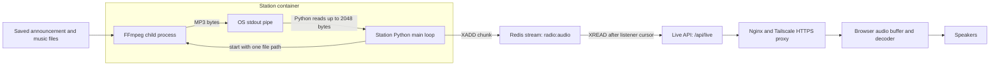

# Station audio: processes, threads, pipes, and Redis

RadioWorkx's station Python process chooses the music and controls transmission.
It starts a separate FFmpeg subprocess for each introduction and each song, reads
that subprocess's output through a pipe, and publishes the audio to Redis. The live
API forwards that audio to browsers; the browser decodes it and plays it through
the listener's speakers.

This document describes the application architecture. It does not cover incident
investigation or diagnostic capture procedures.

## Where each component runs

| Component | Responsibility | Execution model |
| --- | --- | --- |
| Station | Select tracks, transmit introductions and music, record broadcast history | Long-running Python process in the `station` container |
| Announcement preparation | Prepare/cache introductions for upcoming tracks | Background `announcer-queue` thread inside the station Python process |
| FFmpeg transmission | Read one saved audio file and output paced MP3 bytes | Child process started by station Python, inside the same container |
| Redis | Retain a bounded stream of recently published audio chunks | Separate Redis server/container |
| Live API | Read Redis audio independently for each listener and stream HTTP responses | FastAPI/Uvicorn process in the active `api` or `api-next` container; asynchronous streaming task per connection |
| Browser player | Buffer and decode incoming audio, control volume, play sound | Browser on the listener's device |
| Visuals worker | Fetch covers, handle enabled video jobs, and synchronize stored media | Separate Python process in the `visuals` container, with background artwork/storage threads |

A **container** is the environment in which processes run; it is not itself a
thread. A **process** has its own memory space. Threads run within a process and
share its memory. FFmpeg is a child process, not a thread inside Python.

There is one shared broadcast, not a new FFmpeg process for every listener.
Announcement preparation can also launch FFmpeg to normalize a newly generated
speech file; that is separate from the sequential transmission subprocesses.

## Audio flow



The API receives listener requests through the public proxies. The diagram's arrows
show the opposite direction: audio traveling back to the listener.

## How a track starts and finishes

The main loop in [`app/station.py`](../app/station.py) controls this sequence:

1. Check refill needs and inspect the next eligible candidate with `peek()`.
2. Look for an already prepared introduction with `ready_intro()`.
3. Call `select_next()` to recheck the candidate and request identity, reserve the
   broadcast, update the queue, and obtain the selected music file's path.
4. If an introduction is ready, set the announcement state and call
   `transmit(intro['path'])`. That function starts FFmpeg, forwards its output until
   end-of-file, and waits for the subprocess to exit.
5. Call `start_music()` to set the music's broadcast timestamps, clear announcement
   state, and publish the track event. Check refill needs, then call
   `transmit(music_path)` to start a new FFmpeg transmission subprocess for the song.
6. When transmission finishes, record the actual end, update linked requests,
   publish a track-end event, and repeat the selection loop.

The same Python process selects the next track and starts FFmpeg. FFmpeg receives
one file path; it does not query SQLite, choose songs, watch the playlist, or decide
what comes next. The station does not wait for every listener to finish buffering
or listening before proceeding. Server transmission time and audible browser time
can differ.

If an introduction is not ready, the station can proceed with music rather than
wait for speech generation. Selection still follows station eligibility rules.

## What FFmpeg does, and what Python does

The normal transmission command has this shape:

```sh
ffmpeg -v error -re -i FILE -map_metadata -1 -c:a copy \
  -write_xing 0 -id3v2_version 0 -f mp3 pipe:1
```

- `-re` paces file reading approximately at the media's playback rate.
- `-c:a copy` copies the existing MP3 audio rather than re-encoding it. The demo
  path instead applies gain and encodes MP3.
- `pipe:1` directs output to standard output, connected to an operating-system pipe
  created by Python's `subprocess.Popen(..., stdout=subprocess.PIPE)`.

The pipe carries bytes between processes. It is not an audio file or a Redis key.
During live transmission, FFmpeg does not save Redis chunks itself. Python performs
that step:

```python
while block := process.stdout.read(2048):
    audio_redis.xadd('radio:audio', {'chunk': block},
                    maxlen=160, approximate=True)
```

The final read may be shorter than 2,048 bytes. These application chunks are not
necessarily complete MP3 frames, words, or songs. The browser's decoder handles the
continuous sequence of bytes, regardless of Redis or HTTP chunk boundaries.

FFmpeg is also used elsewhere to save normalized audio or images to files. That
file-producing use is distinct from its stdout-pipe use during broadcasting.

## What Redis stores

`radio:audio` is a Redis **stream**, not a cache entry containing a complete song.
Each entry contains:

| Item | Meaning |
| --- | --- |
| Entry ID | Redis timestamp-and-sequence identifier used to order entries and resume reading |
| `chunk` field | Binary MP3 data emitted by the station, normally 2,048 bytes |

The same stream carries the introduction followed by music. Entries do not carry
an announcement transcript or a track boundary marker. Redis IDs reflect publishing
time, not the listener's audio playback position.

The station requests an approximate maximum length of 160 entries. Redis can retain
more than that temporarily because trimming is approximate. This is a short rolling
buffer, not a permanent archive; the original files remain in durable storage.
`radio:events` is a separate stream for application events and browser status updates.
Those events are not audio bytes.

## How the live API reads audio

[`app/live_audio.py`](../app/live_audio.py) implements the audio iterator used by
`GET /api/live` in [`app/api.py`](../app/api.py).

For each authenticated anonymous-listener session connection, the API:

1. Reads the newest entry ID with `XREVRANGE radio:audio COUNT 1` and uses it as the
   initial cursor. If the stream is empty, it starts with `0-0`.
2. Calls `XREAD` for entries after that cursor, waiting for new audio when necessary.
3. Yields each entry's `chunk` bytes into the HTTP response and advances its cursor.
4. Continues until the listener disconnects, then closes its Redis client.

“Listener session” here means the station's signed anonymous listener cookie;
account registration is not required to tune in.

New listeners join the live edge rather than replaying the beginning of the song.
Existing connections drain retained chunks in order. Reading entries does not
remove them: each listener has an independent cursor over the same Redis stream.
A connection that falls behind beyond Redis retention cannot recover trimmed audio.

Nginx and Tailscale carry the response to the browser. The browser buffers and
decodes MP3 before sound is heard. Tune out closes the connection; tuning back in
creates a new connection at the live edge. Temporary stalls preserve playable
buffered audio. The player retries an empty stream that has stopped advancing;
error/end events also trigger bounded reconnection attempts.

## SQLite records and cached announcement files

SQLite stores metadata and broadcast state; it does not store the live audio
chunks. The relevant records are:

| Record | Contents and purpose |
| --- | --- |
| `tracks` | Track identity, music metadata, cached music path, duration, and references to normal/requested introductions |
| `announcements` | Announcement ID, track ID, written dialogue in `script`, source details, cached audio path, duration, creation time, and voice |
| `plays` | Broadcast identity, selected track, expected start/end timestamps, and actual end |
| `settings` entry `announcement_on_air` | JSON describing the introduction currently being transmitted: broadcast ID, track metadata, written dialogue, source, start/end estimates, and voice |

The station writes `announcement_on_air` before introducing a track and clears it
when music starts. This is a setting in SQLite, **not a Redis cache key**. Its timing
supports application status; it is not a command telling FFmpeg to truncate speech.

The `script` column means the announcer's written dialogue. Cached announcement MP3
files live under the shared data directory's `announcements` folder. The database
associates that text with a file; it does not itself verify which words are audible
in the recording.

## Artwork and personal playback are separate paths

The visuals worker fetches original covers independently of audio transmission.
It caches artwork locally and in S3-compatible storage, and the API serves it to the
browser. Still artwork can be fetched while video generation is paused. The visuals
worker does not select songs, run the station's audio loop, or publish live MP3 chunks.

Artist/album and personal playlist playback use the personal-listening endpoints
and cached audio files. They do not change the shared station broadcast or create
an additional station FFmpeg process for that listener.

## Source references

- [`app/workers.py`](../app/workers.py): station startup and independent worker loops.
- [`app/station.py`](../app/station.py): selection, FFmpeg transmission, and broadcast lifecycle.
- [`app/announcer.py`](../app/announcer.py): introduction preparation, caching, and on-air state.
- [`app/live_audio.py`](../app/live_audio.py): per-connection Redis cursor and audio forwarding.
- [`app/api.py`](../app/api.py): HTTP audio, status, and event endpoints.
- [`app/static/app.js`](../app/static/app.js): browser audio and visual controls.
- [`app/visuals.py`](../app/visuals.py): artwork caching and enabled video processing.
- [`app/library.py`](../app/library.py): personal playback endpoints.
